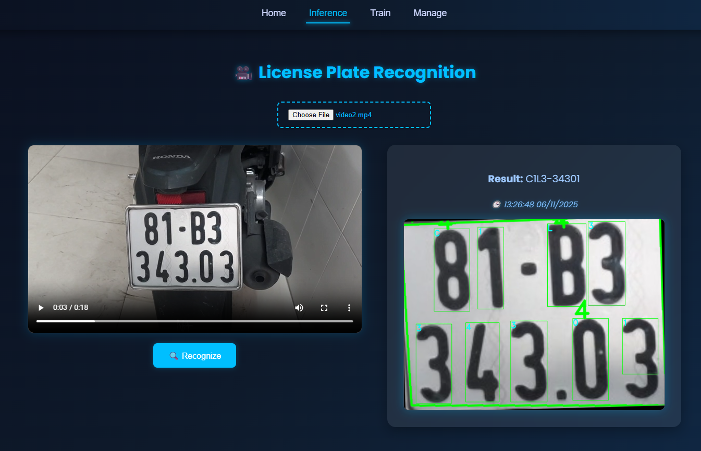
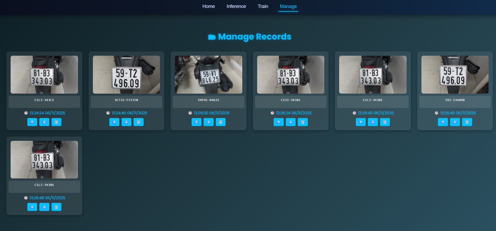
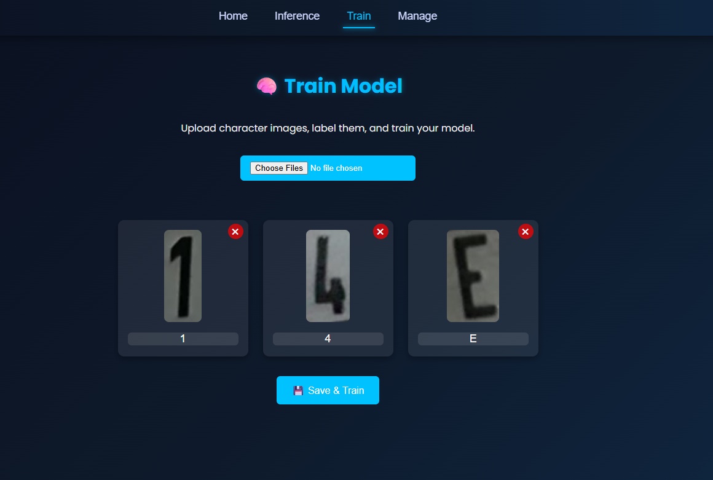

# VIETNAMESE_LICENSE_PLATE using KNN and OpenCV

Check out my 2 YouTube channels for more:
1. [Mrzaizai2k - AI](https://www.youtube.com/channel/UCFGCVG0P2eLS5jkDaE0vSfA) (NEW)
2. [Mrzaizai2k](https://www.youtube.com/channel/UCCq3lQ1W437euT9eq2_26HQ) (OLD)

---

This branch **does not match** the code shown in the YouTube videos above.  
If you want to follow the detailed flow from the tutorials, please switch to the `master` branch or read the documentation [here](https://github.com/mrzaizai2k/VIETNAMESE_LICENSE_PLATE/blob/master/README.md).

The purpose of this branch is to **refactor the old code** and **add a simple UI** to manage license plates — built for educational purposes.  
This file focuses on how to **set up and run the system**, not the recognition logic (which is already explained in the videos).

---

## 📑 Table of Contents
- [Project Overview](#project-overview)
- [Code Structure](#code-structure)
- [How to Setup](#how-to-setup)
  - [Backend](#backend)
  - [Frontend](#frontend)
- [Flow](#flow)
  - [Inference](#inference)
  - [Train](#train)

---

## Project Overview

The system includes multiple tabs in the frontend (React app) to handle different tasks.

### Inference Tab
The **Inference Tab** receives videos (simulating a camera stream).  
When you click **Recognize**, it captures the current frame and sends it to the backend for recognition.  
The recognition logic is implemented in `plate_recognition.py`.

**UI Reference:**  


---

### Manage Tab
In the **Manage Tab**, you can view all captured vehicles, recognized license plate numbers, and the timestamps when they appeared.

**UI Reference:**  


---

### Train Tab
In the **Train Tab**, you can upload character images, label them, and send them to the backend to train the KNN model.  
The backend training function for RGB images is implemented in `GenData2.py`.

**UI Reference:**  


---

## Code Structure

```

📦 Project Root
├── main.py                  # FastAPI entrypoint; defines backend routes like /train/ and /recognize/
├── plate_recognition.py     # Core logic for detecting and recognizing license plates using OpenCV or ML models
├── utils.py                 # Helper functions for config reading, image conversion, and preprocessing
├── Preprocess.py            # Handles data preprocessing before training (resize, normalize, augment)
├── GenData.py               # Generates training data from synthetic image `training_chars.png` (old method)
├── GenData2.py              # Generates training data and labels from raw RGB images (new method)
├── video.py                 # Processes .mp4 or webcam input, extracts frames for detection
├── data/                    # Folder containing input images, dataset splits, or configs
├── result/                  # Output folder for processed images, results, and model outputs
├── requirements.txt         # Python dependency list for the backend (FastAPI, OpenCV, etc.)
└── my-app/                  # React frontend for the user interface
├── src/
│   ├── components/      # Reusable UI components (includes Navbar)
│   ├── pages/           # Application pages for specific functions
│   │   ├── Home.js      # Landing page with general information
│   │   ├── Inference.js # Upload videos/images to recognize license plates; shows results
│   │   ├── Train.js     # Upload training images and start model retraining
│   │   ├── Manage.js    # View or manage uploaded data (move/delete images, etc.)
│   ├── App.js           # Main React app entry; handles routing and navigation
├── package.json         # Node.js dependency and script definitions for React
└── package-lock.json    # Dependency lock file for consistent npm installs

````

---

## How to Setup

### Backend

```bash
conda create -n license python=3.10 -y
conda activate license
pip install -r requirements.txt
python main.py
````

The backend runs by default on **port 8000**.

---

### Frontend

```bash
npx create-react-app my-app
cd my-app
npm install
npm start
```

The frontend runs on **port 3000**.

---

## Flow

### Inference

In the **Inference Tab**, the frontend sends an image (base64 encoded) to the `/recognize/` endpoint defined in `main.py`.
The backend converts the base64 image back to OpenCV format and runs the recognition logic in `plate_recognition.py`.

You can also test recognition manually from the command line:

```bash
python plate_recognition.py
```

After receiving results, the frontend filters all other predictions and only shows the one with the **longest text** (most likely the correct license number).
This logic can be found in `plate_recognition.py`.

The recognized image, text, and timestamp are then saved to **localStorage** to be displayed in the **Manage Tab**.

To try recognize on video. I already add 2 videos in `data/video`

For testing you can try

```bash
    python video.py
```
---

### Train

There are two training scripts:

* `GenData.py`: generates KNN training data from `training_chars.png` (the old synthetic method, used in the master branch).
* `GenData2.py`: the upgraded version that trains from real **RGB character images** uploaded via the UI.

The **Train Tab** in the frontend calls the `/train/` endpoint, which uses the function
`create_knn_data_from_rgb()` in `GenData2.py` to update the KNN model and append data to:

* `classifications.txt`
* `flattened_images.txt`

For testing you can use

```bash
    python GenData.py
```

or

```bash
    python GenData2.py
```